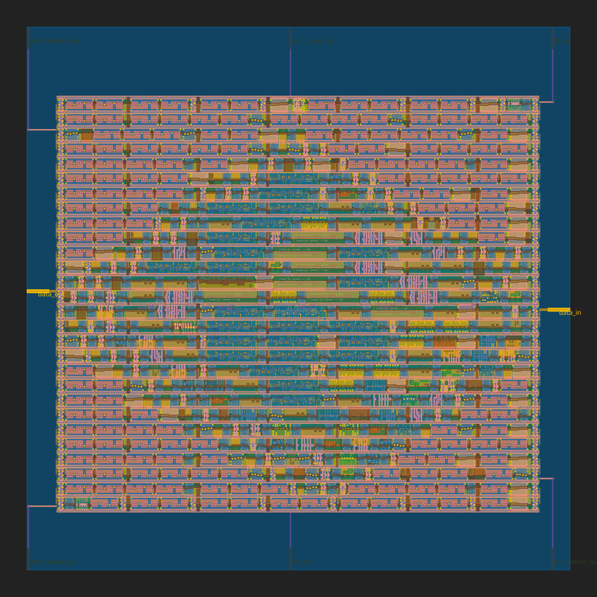

# FROG 4-bit CPU

The FROG is a tiny 4-bit processor intended to be incorporated into the [TinyTapeout](https://mailchi.mp/574276e3c9d7/tinytapeout) multi-project chip on a multi-project wafer

The FROG is an extremely minimal load-store 4-bit CPU.  Specified, designed, and tested in less than a day (given I discovered TinyTapeout with 36 hours remaining), several structures were simplified for speed of design.

### ISA

**Registers**: 4-bit, A and B
**ALU Width**: 4-bit
**Address Width**: 6-bit
**Instructions**: 15+NOP

| OPCode | Hex | Description|
| --- | --- | --- |
NGA      | 0             | 2's complement negation of A
AND      | 1             | A = A AND B
OR       | 2             | A = A OR B
XOR      | 3             | A = A XOR B
SLL      | 4             | A = A << B
SRL      | 5             | A = A >> B
SRA      | 6             | A = A >> B (preserve sign)
ADD      | 7             | A = A + B
NOP      | 8             | No Operation
BEQ ofst | 9 AddrH AddrL | If A == B, PC = PC + offset
BLE ofst | A AddrH AddrL | If A <= B, PC = PC + offset
JMP addr | B AddrH AddrL | PC = addr
LDA addr | C AddrH AddrL | A = [addr]
LDB addr | D AddrH AddrL | B = [addr]
STA addr | E AddrH AddrL | [addr] = A
STB addr | F AddrH AddrL | [addr] = B

 

The [Makefile](Makefile) has been modified to support the same github action as the template repository without actually pulling from Wokwi.
